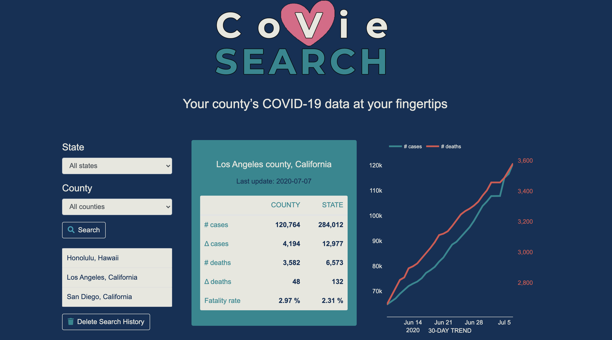

# covie_search

[COVIE SEARCH Git Repo](https://github.com/jaaybe/covidsearch)
 
[Covie search Live Link](https://jaaybe.github.io/covidsearch/)

created by: JB Blot, Sandrine Poissonnet, Natalia Teaca, Kelly Elliot, and Alica Ross.

## Description
COVIE SEARCH gives you a quick way to check the latest COVID-19 Virus Statistics in your County. Our data comes from an API built by Axisbits, which gathers the latest COVID statistics details from the Johns Hopkins Center for Systems Science and Engineering (CSSE) database. The data is refreshed daily. The visual county map representation is based off the latitude and longitude provided by the Johns Hopkins CSSE database when run through GoogleMaps.

## Technology Used
<ul>
<li>git and GitHub</li>
<li>HTML</li>
<li>CSS</li>
<li>Javascript</li>
<li>JQuery</li>
<li>Bootstrap</li>
<li>Moment.js</li>
<li>Plotly.js</li>
<li>Fetch</li>
<li>Wireframe</li>
<li>3rd Party APIs</li>
